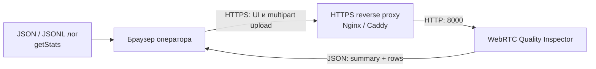
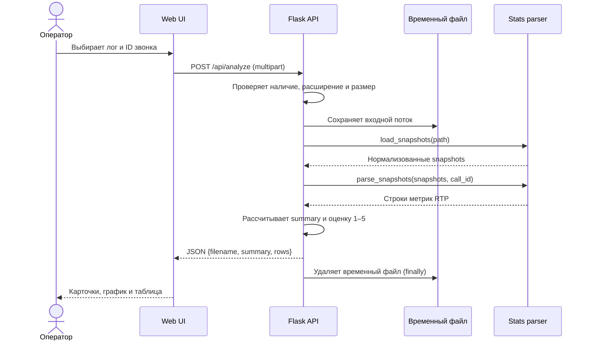
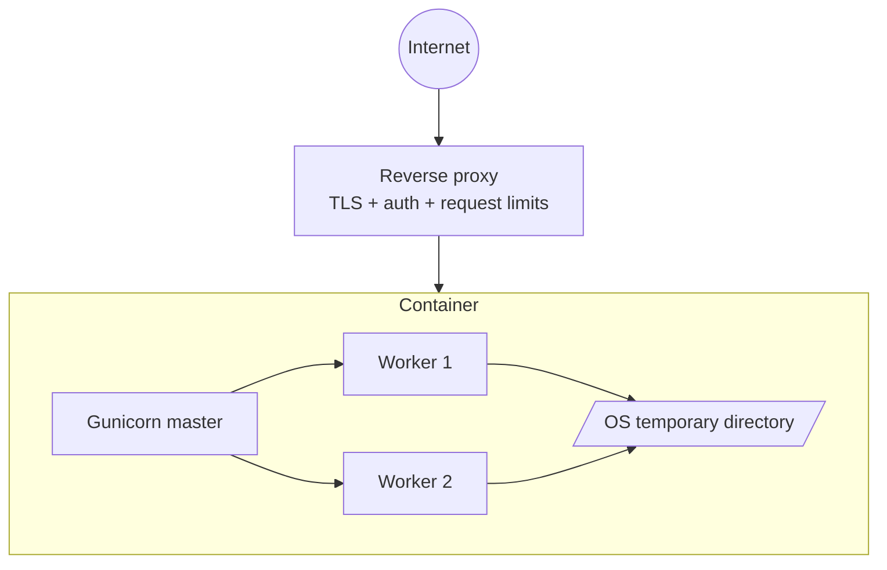

# Архитектура WebRTC Quality Inspector

## 1. Назначение и границы системы

WebRTC Quality Inspector принимает выгрузку `RTCPeerConnection.getStats()`, нормализует разные варианты JSON, рассчитывает показатели RTP-потоков и показывает оператору сводную оценку качества звонка.

Система предназначена для **посмертного анализа загруженного лога**, а не для мониторинга звонка в реальном времени. В текущей версии нет учётных записей, постоянного хранилища, фоновых задач и централизованного сбора логов с клиентских приложений.

## 2. Контекст



Для публичного размещения reverse proxy является обязательной границей безопасности: он завершает TLS, ограничивает доступ, задаёт дополнительные лимиты запроса и журналирует обращения. Само приложение слушает внутренний порт `8000`.

## 3. Компоненты

| Компонент | Ответственность |
|---|---|
| `templates/index.html` | Каркас интерфейса загрузки и представления результатов. |
| `static/app.js` | Отправка `multipart/form-data`, обработка ответа API, построение графика и таблицы. |
| `static/app.css` | Адаптивное визуальное оформление. |
| `web_app.py` | HTTP-маршруты, валидация загрузки, управление временным файлом и формирование сводки. |
| `webrtc_stats_parser.py` | Чтение JSON/JSONL, нормализация RTCStats и расчёт метрик по RTP-потокам. |
| Gunicorn | Production WSGI-сервер и управление рабочими процессами. |
| Docker | Воспроизводимая среда запуска и health check. |

Зависимости направлены внутрь: web-слой вызывает публичные функции парсера, но парсер ничего не знает о Flask, HTTP или интерфейсе. Поэтому расчёты можно использовать отдельно через существующий CLI.

## 4. Поток обработки данных



1. Клиент принимает файлы `.json`, `.jsonl`, `.log` и `.txt`.
2. Flask дополнительно проверяет расширение и ограничивает тело запроса через `MAX_CONTENT_LENGTH` (по умолчанию 20 МБ).
3. Файл получает случайное имя во временном каталоге. Исходное имя используется только после обработки `secure_filename` и возвращается для отображения.
4. Парсер приводит входные варианты к последовательности снимков `{timestamp, call_id, stats}`.
5. Для локальных `inbound-rtp` и `outbound-rtp` записей рассчитываются потери, джиттер, RTT и битрейт. Связанные codec, remote-inbound и ICE candidate записи обогащают результат.
6. API агрегирует средние значения и классифицирует качество.
7. Временный файл удаляется в блоке `finally`, в том числе при ошибке разбора.

## 5. Модель данных API

### Запрос

`POST /api/analyze`, тип `multipart/form-data`:

- `log` — обязательный файл;
- `call_id` — необязательный идентификатор, если его нет внутри снимков.

### Успешный ответ

```json
{
  "filename": "call.jsonl",
  "summary": {
    "quality": "Хорошее",
    "score": 4,
    "samples": 120,
    "calls": 1,
    "call_ids": ["call-42"],
    "media": {"audio": 60, "video": 60},
    "avg_loss_pct": 0.4,
    "avg_jitter_ms": 12.1,
    "avg_rtt_ms": 85.3,
    "avg_bitrate_kbps": 734.2
  },
  "rows": [
    {
      "timestamp": "2026-08-18T12:00:00.000Z",
      "call_id": "call-42",
      "direction": "inbound",
      "media_kind": "audio",
      "packet_loss_pct": 0.4,
      "jitter_ms": 12.1,
      "rtt_ms": 85.3,
      "bitrate_kbps": 64.0
    }
  ]
}
```

Ошибки валидации или разбора возвращаются как `{"error": "..."}` со статусом `400`; превышение лимита — со статусом `413`. `GET /health` возвращает `{"status": "ok"}` для container health check.

## 6. Расчёт показателей качества

| Оценка | Условие срабатывания хотя бы по одному среднему показателю |
|---|---|
| 1 — плохое | потери ≥ 5%, джиттер ≥ 50 мс или RTT ≥ 400 мс |
| 2 — нестабильное | потери ≥ 2%, джиттер ≥ 30 мс или RTT ≥ 250 мс |
| 3 — удовлетворительное | потери ≥ 1%, джиттер ≥ 20 мс или RTT ≥ 150 мс |
| 4 — хорошее | потери ≥ 0,3%, джиттер ≥ 10 мс или RTT ≥ 80 мс |
| 5 — отличное | все показатели ниже порогов оценки 4 |

Классификация является оперативным индикатором, а не стандартом MOS. Если показатель отсутствует, он не ухудшает оценку. Для продуктового использования пороги следует проверить на реальных звонках и сделать конфигурируемыми по типу медиа и сети.

## 7. Развёртывание



Контейнер запускает два синхронных Gunicorn worker от непривилегированного пользователя. Приложение stateless: контейнер можно перезапускать или горизонтально масштабировать без миграции данных. Поскольку разбор выполняется синхронно, один анализ занимает worker до завершения; лимит загрузки защищает память и время обработки лишь частично.

Рекомендуемые production-настройки:

- TLS и аутентификация на reverse proxy;
- запрет прямого доступа к порту приложения извне;
- одинаковый лимит тела запроса на proxy и в `MAX_UPLOAD_MB`;
- лимиты CPU/RAM, read timeout и rate limiting;
- централизованные stdout/stderr логи без содержимого загруженных файлов;
- отдельный домен или строгая Content Security Policy для внешнего Chart.js CDN; при закрытом контуре — локальная поставка библиотеки.

## 8. Безопасность и приватность

- Загруженный файл не является доверенным: сервер разрешает только известные расширения и парсит его как данные, не выполняя содержимое.
- Имя проходит через `secure_filename`; рабочий файл получает случайное имя.
- Временный файл удаляется после каждого запроса, но кратковременно находится на диске узла. Для чувствительных логов следует использовать зашифрованный диск или `tmpfs`.
- Лимит размера снижает риск отказа в обслуживании, но не заменяет rate limiting, timeout и аутентификацию.
- UI вставляет строковые значения через экранирование; новые поля нельзя выводить через необработанный `innerHTML`.
- Приложение не должно логировать тело запроса, SDP, IP-адреса кандидатов и иные потенциальные персональные данные.

## 9. Наблюдаемость

Текущий `/health` проверяет только доступность процесса. Для эксплуатации стоит добавить:

- structured access/error logs с request ID;
- метрики количества и длительности анализов, размера файлов и кодов ошибок;
- readiness endpoint, отличный от liveness;
- алерты по доле `4xx/5xx`, времени обработки и рестартам контейнера.

Содержимое звонков и полный результат анализа не должны становиться labels метрик или попадать в логи.

## 10. Масштабирование и дальнейшее развитие

Текущая архитектура подходит для одного сервера и небольшого числа параллельных анализов. Эволюция нужна по мере появления требований:

1. **Большие файлы или долгий разбор:** объектное хранилище, очередь задач и отдельные workers; API возвращает `analysis_id`, UI опрашивает статус.
2. **История и совместная работа:** PostgreSQL для метаданных и результатов с политикой retention; исходные логи сохранять только при явном согласии.
3. **Много пользователей:** OIDC/SSO, роли и изоляция данных по tenant.
4. **Онлайн-мониторинг:** отдельный ingest API/WebSocket, time-series storage и потоковая агрегация — не расширение upload endpoint.
5. **Закрытый контур:** убрать CDN и поставлять Chart.js внутри образа.

Важно не добавлять базу данных или очередь заранее: stateless-вариант проще разворачивать и безопаснее с точки зрения хранения приватных WebRTC-логов.

## 11. Архитектурные решения

### ADR-001: переиспользовать независимый парсер

**Решение:** web-слой импортирует `load_snapshots` и `parse_snapshots` из CLI-парсера.
**Причина:** одна реализация нормализации и расчётов для CLI и HTTP.
**Следствие:** parser module должен оставаться независимым от Flask.

### ADR-002: не хранить загруженные файлы

**Решение:** анализ выполняется через временный файл, который удаляется после запроса.
**Причина:** минимизация объёма чувствительных данных и отсутствие требований к истории.
**Следствие:** результат нельзя открыть повторно; пользователь должен снова загрузить лог.

### ADR-003: синхронный HTTP-анализ

**Решение:** обработка завершается в рамках `POST /api/analyze`.
**Причина:** простота эксплуатации для файлов до установленного лимита.
**Следствие:** при росте длительности или нагрузки потребуется асинхронная схема с очередью.

### ADR-004: stateless Docker-сервис

**Решение:** production-запуск осуществляется Gunicorn в контейнере без постоянного volume.
**Причина:** воспроизводимость, простой rollback и горизонтальное масштабирование.
**Следствие:** TLS, доступ и долговременные данные находятся за границами приложения.
